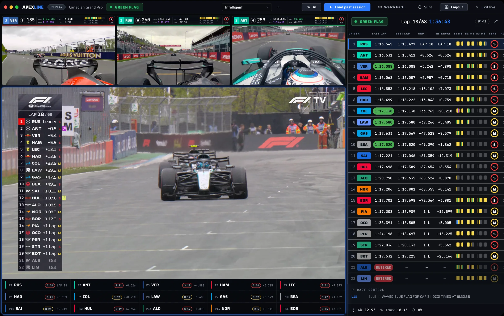

# Apexline

A macOS app for Formula 1 race weekends. Apexline puts F1 TV video, live
timing, onboards, the track map, standings, news and race analytics in one
window. Website and downloads: <https://apexline.io>



Apexline is an unofficial app. It is not affiliated with, endorsed by or
connected to Formula 1, F1 TV, the FIA or any team. Watching video needs your
own active F1 TV subscription.

## Run from source

Requires macOS on Apple silicon and a current Node.js LTS release.

```bash
git clone https://github.com/neelsatyavolu/apexline.git
cd apexline
npm install
npm start
```

`npm start` builds the renderer into `dist/pitwall` and launches Electron.
`npm test` runs the smoke tests.

## Configuration

Everything works without extra setup. These optional environment variables
change where data comes from:

| Variable | Purpose |
| --- | --- |
| `OPENF1_EMAIL`, `OPENF1_PASSWORD` | Use your own OpenF1 account instead of the Apexline proxy. |
| `APEXLINE_SOCIAL_API_BASE_URL` | Point watch parties and the OpenF1 proxy at your own deployment of `updates-site`. |

AI Copilot signs in with your own ChatGPT (Codex) or Grok account from
Settings. F1 TV and AI credentials are stored locally on your Mac.

## Project layout

| Path | What it is |
| --- | --- |
| `electron/` | Main process: data fetching, F1 TV, live timing, updates, IPC. |
| `ui_kits/pitwall/` | React renderer, one file per screen. |
| `tokens/`, `styles.css` | Design tokens shared by the app and website. |
| `updates-site/` | The apexline.io website, update feed and serverless APIs (Vercel). |
| `scripts/` | Build, packaging, release and test scripts. |

Signed release builds need an Apple Developer ID and are produced with
`npm run release:mac`; contributors don't need this to run the app.

## Contributing

Bug reports and pull requests are welcome at
<https://github.com/neelsatyavolu/apexline/issues>. Please run `npm test`
before opening a pull request.

## License

[MIT](LICENSE). Formula 1, F1 and related marks belong to their owners and are not
covered by this license.
